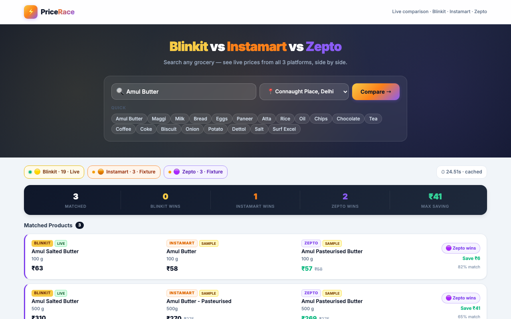
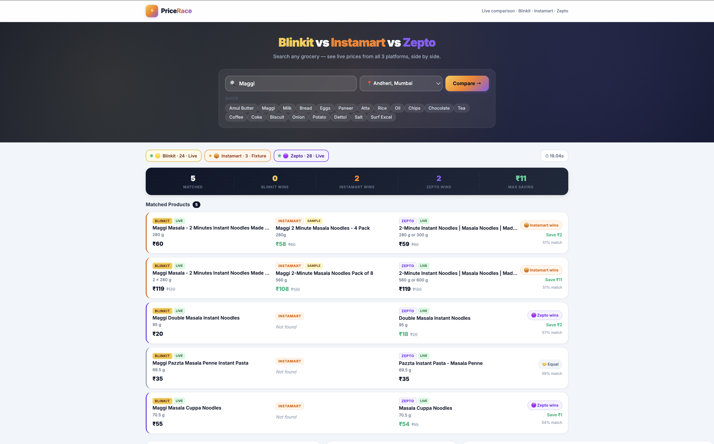
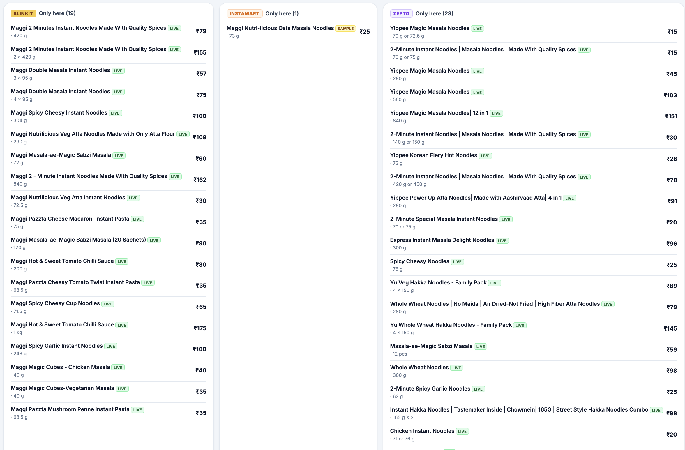

# PriceRace 🛒⚡

> **Real-time grocery price comparison across Blinkit, Swiggy Instamart & Zepto.**
> Search any product — get matched pairs side-by-side with the cheapest platform highlighted instantly.

---

## Demo

### Hero — Search UI


### Maggi — Live Blinkit results vs fixture fallback


### Amul Butter — Live 3-way comparison



---

## What it does

1. **Search** any grocery item (Maggi, Amul Butter, Milk, Eggs…) and pick a delivery location.
2. The backend **concurrently** hits three platforms:
   - 🟡 **Blinkit** — Playwright scraper (captures the site's own internal JSON)
   - 🟠 **Instamart** — Playwright scraper with fixture fallback (Swiggy WAF is aggressive)
   - 🟣 **Zepto** — Live REST API via [QuickCommerce API](https://quickcommerceapi.com) — returns in ~1s
3. `matcher.py` **pairs** equivalent products across platforms — same brand, same normalized pack size, similar name — and scores each pair's confidence (0–100%).
4. The UI shows **matched triplets** side-by-side: cheaper price in green, savings, unit price (per 100 g / 100 ml / piece), and a 5-stat summary bar (Matched / Blinkit Wins / Instamart Wins / Zepto Wins / Max Saving).

---

## Quick start

```bash
git clone https://github.com/techbhuvi04/Cardekho.git
cd Cardekho

python3 -m venv .venv
source .venv/bin/activate        # Windows: .venv\Scripts\activate
pip install -r requirements.txt
python -m playwright install chromium

python app.py
```

Open **http://127.0.0.1:8000**, type a query, pick a location, hit **Compare →**.

- First search for a query/location takes ~20-30s (live scrape + API call).
- Repeat searches within 10 minutes are served from cache instantly.
- **Best Zepto results:** pick Mumbai or Bangalore locations — Zepto has strong coverage there.

> **Tip:** `HEADLESS=0 python app.py` shows the browser window — helpful on networks where Instamart's WAF is aggressive.

---

## Locations

| Key | City |
|---|---|
| `connaught_place` | Connaught Place, Delhi |
| `nsut_dwarka` | NSUT Dwarka, Delhi |
| `cyber_city_gurugram` | Cyber City, Gurugram |
| `bandra_mumbai` | Bandra, Mumbai ⭐ Zepto |
| `andheri_mumbai` | Andheri, Mumbai ⭐ Zepto |
| `koramangala_blr` | Koramangala, Bangalore ⭐ Zepto |
| `indiranagar_blr` | Indiranagar, Bangalore ⭐ Zepto |

---

## Project layout

| File | Purpose |
|---|---|
| `app.py` | FastAPI app — serves the UI and `/api/search`, handles caching and concurrency |
| `scrapers.py` | Playwright scrapers for Blinkit & Instamart; `scrape_zepto()` via QuickCommerce API (httpx) |
| `matcher.py` | `match_three_way()` — pairs products across 3 platforms, scores confidence, computes unit prices |
| `mock_instamart.py` | 18-category fixture catalog (Blinkit + Instamart + Zepto) used as fallback when live scrape returns nothing |
| `static/index.html` | Single-page UI — vanilla JS, no build step, dark-mode with shimmer loading |

---

## API

```
GET /api/locations
GET /api/search?q=<query>&loc=<location_key>
DELETE /api/cache
```

The search endpoint returns:
```json
{
  "matches":       [...],   // matched triplets with cheapest + saving
  "blinkit_only":  [...],   // items only on Blinkit
  "instamart_only":[...],
  "zepto_only":    [...],
  "blinkit":       { "count": 21, "is_sample": false, "elapsed_s": 22.1 },
  "instamart":     { "count": 3,  "is_sample": true,  "elapsed_s": 22.1 },
  "zepto":         { "count": 8,  "is_sample": false, "elapsed_s": 1.3  }
}
```

---

## How matching works

Product names are tokenized → Jaccard overlap scored → pack sizes normalized
(`4 × 70 g → 280 g`, `1 pack (500 ml) → 500 ml`) → brands cross-checked →
greedy one-to-one assignment by highest confidence first.

Zepto's `"1 pack (500 g)"` quantity format is automatically stripped to `"500 g"`
before matching so sizes align across platforms.

---

## Known limitation: Instamart WAF

Swiggy Instamart runs an aggressive WAF that blocks automated traffic outright — confirmed
even with plain `curl`. When a live Instamart scrape returns zero items the app falls back
to a hardcoded fixture dataset in `mock_instamart.py` (clearly labelled **SAMPLE** in the UI).

---

## Tech stack

- **Backend:** Python · FastAPI · Playwright · httpx
- **Frontend:** Vanilla HTML/CSS/JS · Google Fonts Inter · No build step
- **Live data:** Blinkit & Instamart via Playwright · Zepto via [QuickCommerce API](https://quickcommerceapi.com)
